# AWS Cloud Lab: Custom VPC Configuration

This guide demonstrates how to configure a Virtual Private Cloud (VPC) with public and private subnets, an Internet Gateway, and a NAT Gateway for secure outbound traffic.

## Table of Contents
1. [VPC Initialization](#1-vpc-initialization)
2. [Public Subnet Creation](#2-public-subnet-creation)
3. [Enable Public IPv4 Auto-assignment](#3-enable-public-ipv4-auto-assignment)
4. [Private Subnet Creation](#4-private-subnet-creation)
5. [Internet Gateway (IGW) Setup](#5-internet-gateway-igw-setup)
6. [Public Route Table Configuration](#6-public-route-table-configuration)
7. [NAT Gateway Configuration](#7-nat-gateway-configuration)
8. [Private Route Table Configuration](#8-private-route-table-configuration)

---

### 1. VPC Initialization
Ensure the base VPC is created and configured. In this lab, we use the **Lab VPC** with CIDR `10.0.0.0/16`.

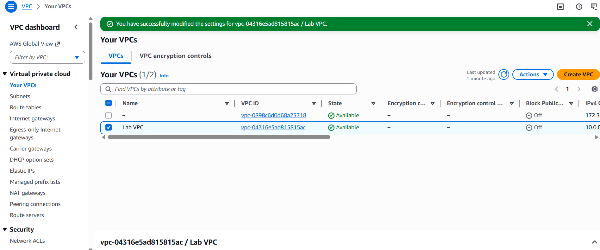

### 2. Public Subnet Creation
Create a subnet that will be used for public-facing resources.
* **Name:** `Public Subnet`
* **IPv4 CIDR:** `10.0.0.0/24`

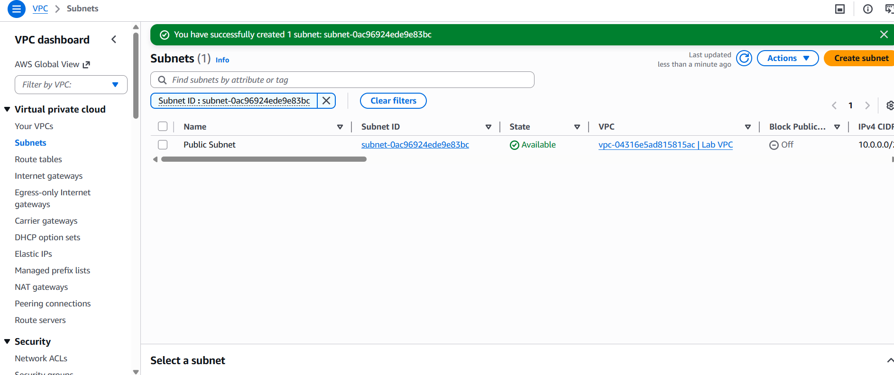

### 3. Enable Public IPv4 Auto-assignment
Modify the Public Subnet settings so that any instance launched inside it automatically receives a public IP address.
1. Select the subnet and go to **Actions** > **Edit subnet settings**.
2. Enable **Auto-assign public IPv4 address**.

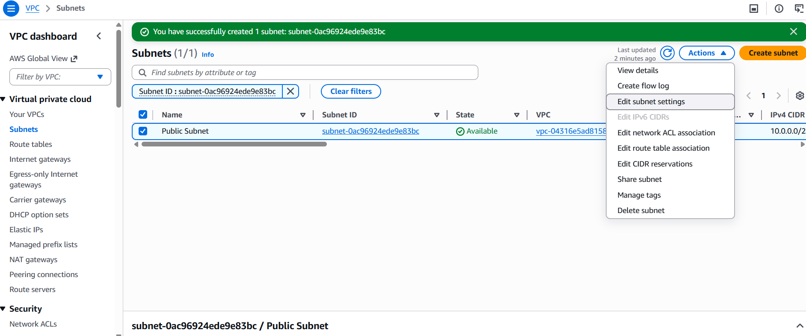
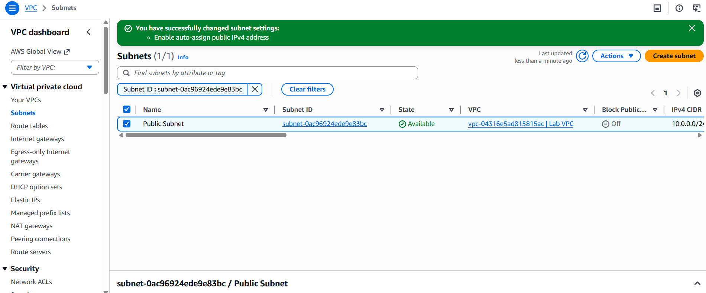

### 4. Private Subnet Creation
Create a second subnet that will remain isolated from direct inbound internet traffic.
* **Name:** `Private Subnet`
* **IPv4 CIDR:** `10.0.2.0/24`

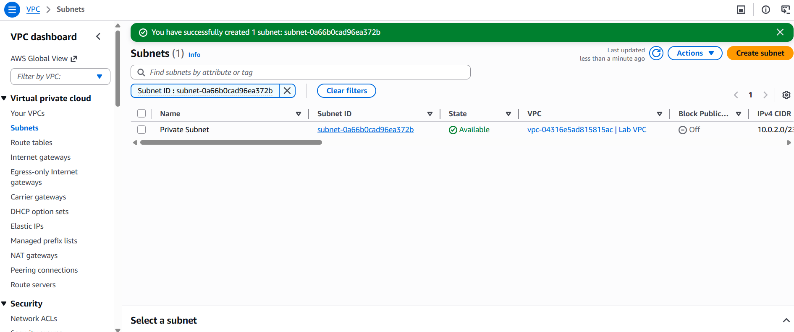

### 5. Internet Gateway (IGW) Setup
To allow internet access to the VPC, create an Internet Gateway and attach it to the Lab VPC.

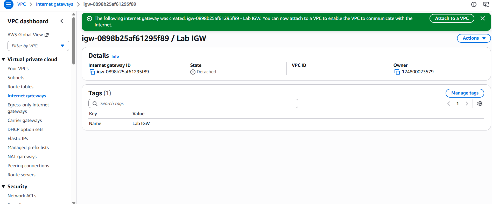
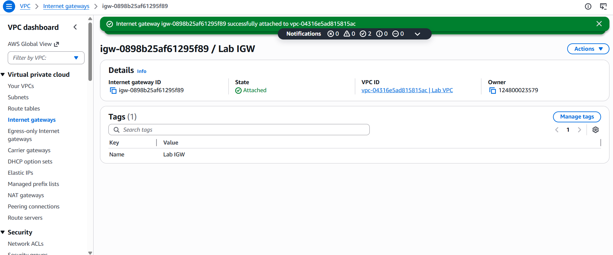

### 6. Public Route Table Configuration
Create a new route table for the public subnet and add a route to direct all non-local traffic (`0.0.0.0/0`) to the Internet Gateway.

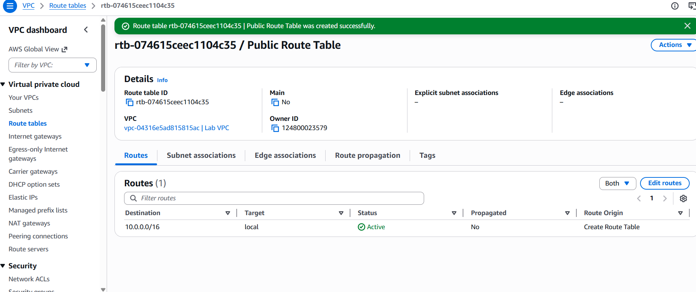
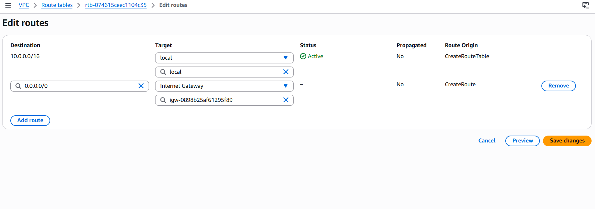
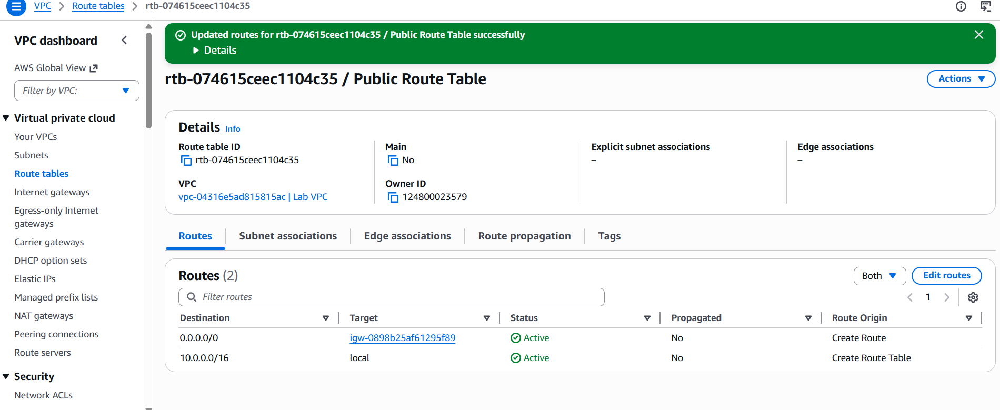

### 7. NAT Gateway Configuration
A NAT Gateway allows resources in the private subnet to access the internet for updates while blocking incoming connections from the internet.
1. **Allocate an Elastic IP.**
2. **Create the NAT Gateway** in the **Public Subnet**.

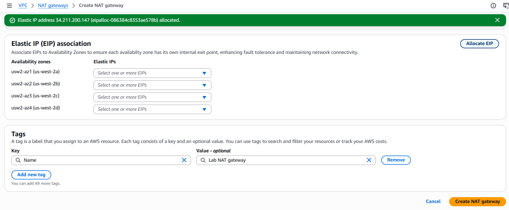
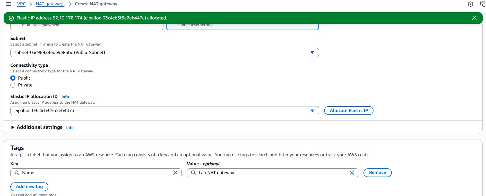
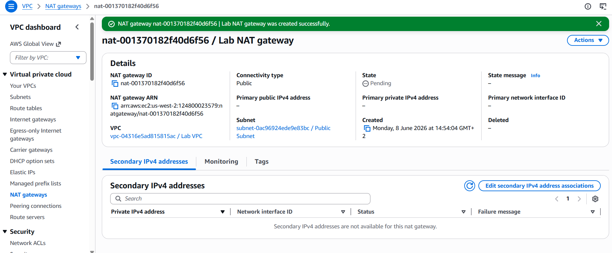

### 8. Private Route Table Configuration
Update the route table associated with the Private Subnet. Add a route for `0.0.0.0/0` targeting the **NAT Gateway** created in the previous step.

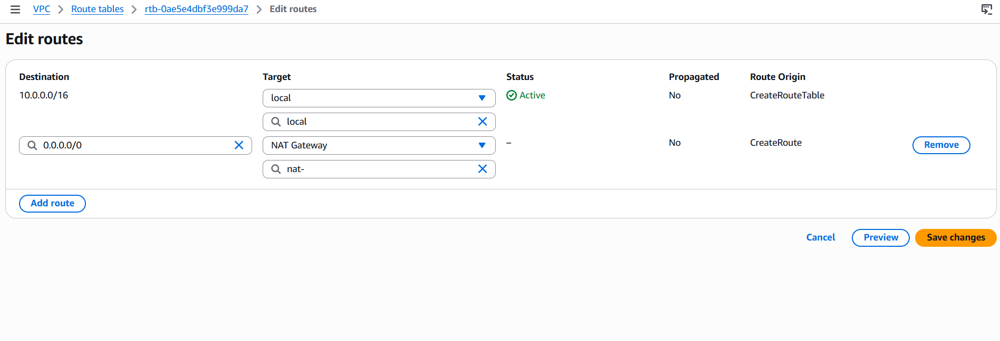

---
**End of Lab Configuration.**
