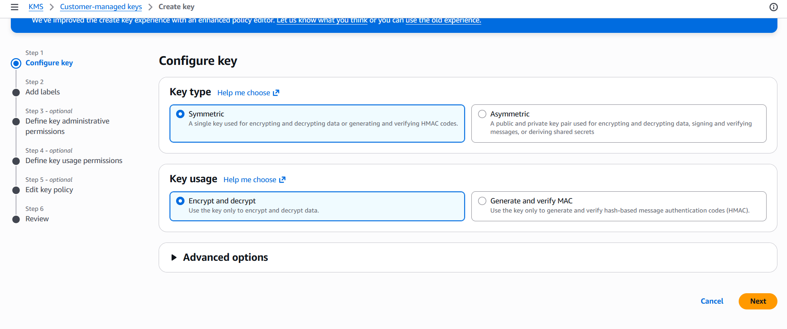
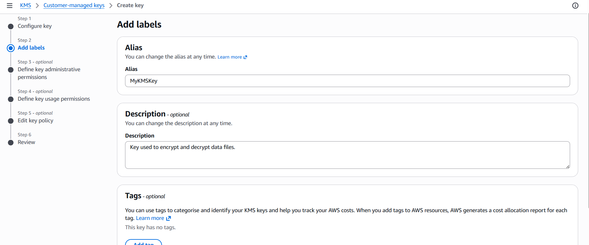
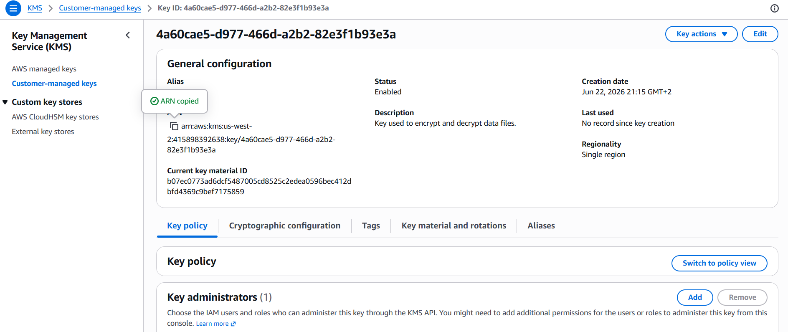
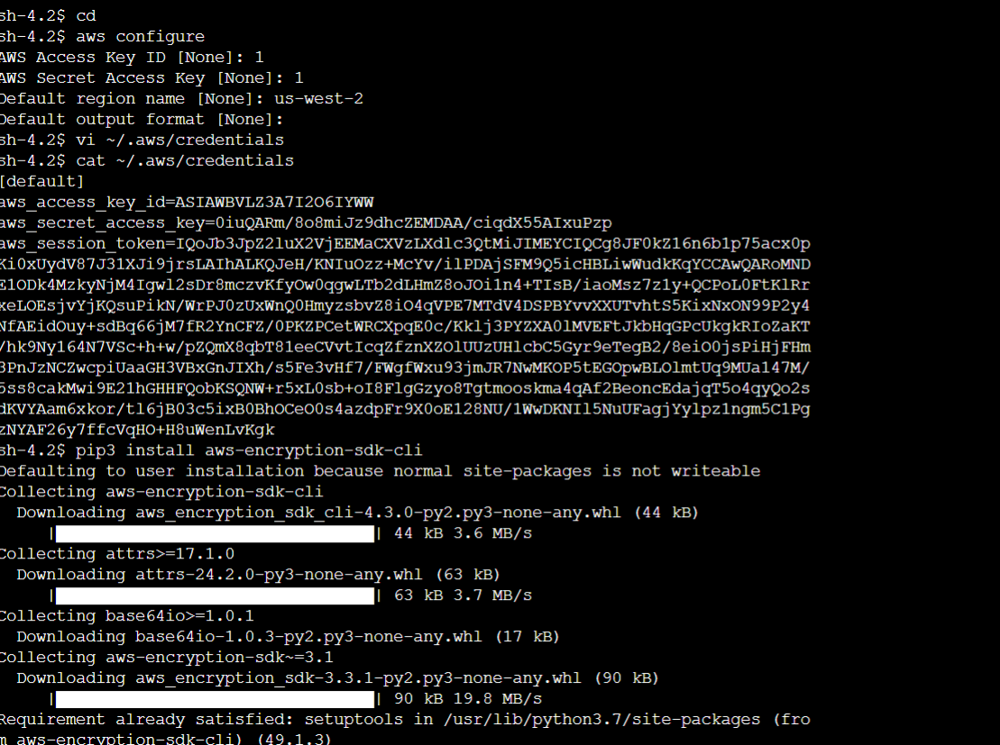
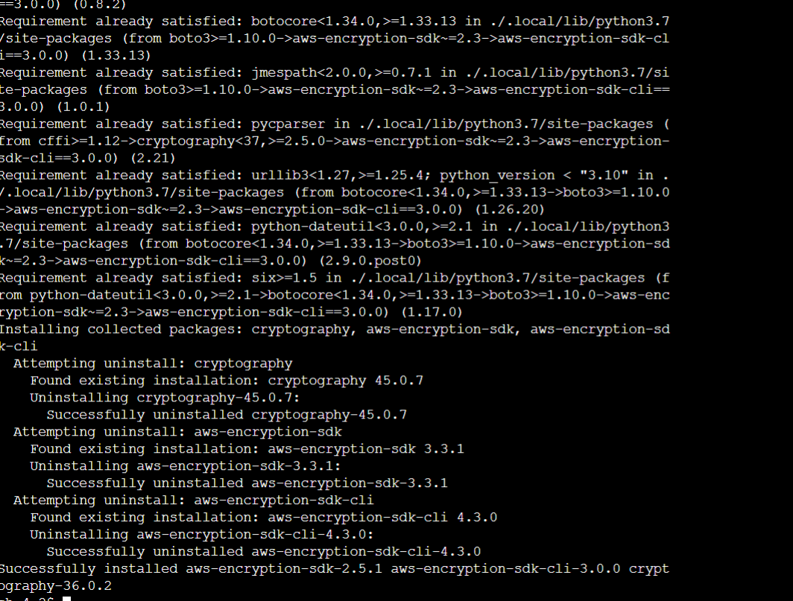

# Data Protection Using Encryption on AWS

This repository documents a hands-on lab focused on protecting data at rest using **AWS Key Management Service (KMS)** and the **AWS Encryption SDK CLI**. The project involves creating a symmetric encryption key, configuring an EC2 file server, and performing envelope encryption on sensitive files.

## 🎯 Objectives
- Create a symmetric AWS KMS encryption key.
- Configure AWS CLI credentials and session tokens on a remote instance.
- Troubleshoot Python dependency issues and install the AWS Encryption CLI.
- Encrypt plaintext files into ciphertext.
- Decrypt ciphertext back into original plaintext.

---

## 🛠️ Step 1: Create an AWS KMS Key
I started by creating a Customer Managed Key (CMK) in the AWS KMS console.

1. **Configure Key:** Selected **Symmetric** key type for efficient encryption/decryption.
2. **Add Labels:** Assigned the alias `MyKMSKey`.
3. **Permissions:** Defined the `voclabs` IAM role as both the Key Administrator and Key User.


*Configuring the Symmetric Key*


*Adding the Alias and Description*


*The generated Key ARN: arn:aws:kms:us-west-2:415898392638:key/4a60cae5-d977-466d-a2b2-82e3f1b93e3a*

---

## 💻 Step 2: Configure the File Server Instance
I connected to the EC2 File Server via Session Manager and configured the environment to use the KMS key.

1. **AWS Configure:** Initialized the default region to `us-west-2`.
2. **Credentials:** Updated the `~/.aws/credentials` file with the temporary lab session tokens.


*Initializing AWS CLI settings*


*Updating local AWS credentials*

---

## 🔧 Step 3: Troubleshooting & Installation
When installing the AWS Encryption CLI, I encountered a `ModuleNotFoundError` for `importlib.metadata` due to the instance running Python 3.7.

**Resolution:**
I manually installed `importlib-metadata` and pinned the SDK CLI to version `3.0.0` to ensure compatibility with the environment.


*Successful installation of compatible SDK version*

---

## 🔒 Step 4: Encrypting Data
I created a file called `secret1.txt` containing the string `"TOP SECRET 1!!!"` and used the KMS key to encrypt it.

```bash
# Set the Key ARN variable
keyArn=arn:aws:kms:us-west-2:415898392638:key/4a60cae5-d977-466d-a2b2-82e3f1b93e3a

# Encrypt the file
aws-encryption-cli --encrypt \
                     --input secret1.txt \
                     --wrapping-keys key=$keyArn \
                     --metadata-output ~/metadata \
                     --encryption-context purpose=test \
                     --commitment-policy require-encrypt-require-decrypt \
                     --output ~/output/.
